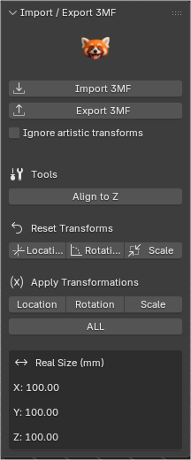
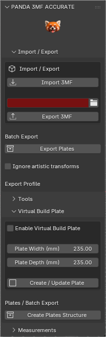

# Panda 3MF Accurate Toolbox

**Panda 3MF Accurate Toolbox** is a professional Blender addon focused on accurate and reliable **3MF import/export workflows for real-world 3D printing**.

The addon is designed for users who require precise scale handling, clean export pipelines, and efficient batch workflows directly inside Blender, without relying on external conversion tools or repetitive file dialogs.

---

## 🔧 Key Features

### 3MF Import / Export
- Import and export 3MF files directly in Blender.
- Fast export workflow with a configurable export folder.
- Visual feedback when export settings are incomplete.
- Optional ignoring of artistic transforms for print-accurate geometry.

### Export Folder Workflow
- Select an export folder directly from the addon panel.
- The export folder field is highlighted in **red** when no folder is selected.
- Once configured, all exports are sent automatically to the selected location.
- If the Blender project is not yet saved, the addon prompts to save the `.blend` file during the first export.
- Subsequent exports run instantly without additional dialogs.

### Batch Export by Build Plates
- Export multiple build plates in a single operation.
- Each child collection under the **Plates** collection is exported as a separate 3MF file.
- Automatic validation against configured build plate dimensions.

### Virtual Build Plate
- Visualize a printer build plate directly inside Blender.
- Helps organize and prepare models before slicing.
- Designed as a visual aid, not a slicer replacement.

### Transform Tools for 3D Printing
- Align objects to the build surface (Z axis).
- Reset and apply transforms safely.
- Prepare geometry for reliable slicing and printing.

### Real Size Measurements
- Display accurate X / Y / Z dimensions in millimeters.
- Values correspond directly to slicer-reported dimensions.

---

## 🧩 Typical Workflow

1. Model or import geometry into Blender.
2. Verify real-world size using the Measurements panel.
3. Align objects and apply transforms if needed.
4. (Optional) Use the Virtual Build Plate to organize parts.
5. Select an export folder.
6. Export using **Export 3MF** or **Export Plates**.
7. Open the exported file in your preferred slicer  
   (Orca, Bambu Studio, PrusaSlicer, Cura, etc.).

---

## ⚠️ Limitations

- This addon **does not fix geometry** or make models printable.
- No automatic detection or correction of non-manifold meshes.
- Final print validation is always performed by the slicer.
- Geometry is exported exactly as it exists in the Blender scene.

---

## 🆓 Free vs Accurate Version

| Feature | Panda 3MF Toolbox (Free) | Panda 3MF Accurate Toolbox |
|--------|--------------------------|----------------------------|
| Basic 3MF Import / Export | ✔ | ✔ |
| Export Folder Workflow | ✔ | ✔ |
| Batch Export (Plates) | ✖ | ✔ |
| Virtual Build Plate | ✖ | ✔ |
| Transform Tools | Limited | ✔ |
| Real Size Measurements | ✔ | ✔ |
| Advanced Workflow Tools | ✖ | ✔ |

<table align="center">
  <tr>
    <td align="center">
      
       <b>Free Version</b>
    </td>
    <td align="center">
      
       <b>Accurate Version</b>
    </td>
  </tr>
</table>

---
### Ignore Artistic Transforms

This option exports the model using its real physical size, ignoring visual-only transforms applied in Blender.

Use this if you scaled or rotated an object just for visualization or layout, but want to export it at its original real-world size for 3D printing.

This does not modify the object in the scene.

---

## 📦 Availability

### Free Version
Available through **Blender Extensions**.

### Panda 3MF Accurate Toolbox (Paid Version)
Available via Gumroad.

---

## 🛒 Purchase

You can purchase the **Panda 3MF Accurate Toolbox** here:

👉 *(Gumroad link coming soon)*

---

## 🐞 Bug Reports & Support

This repository is used for:
- Documentation
- Issue tracking
- User support

⚠️ **The source code of Panda 3MF Accurate Toolbox is not publicly available.**

When reporting an issue, please include:
- Blender version
- Operating system
- Steps to reproduce the problem

---

## 📄 Documentation

A complete **PDF user manual** (EN / ES) is included with the paid version of the addon.

---

## © Credits

Developed and maintained by **Panda Print**.
