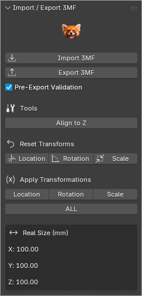
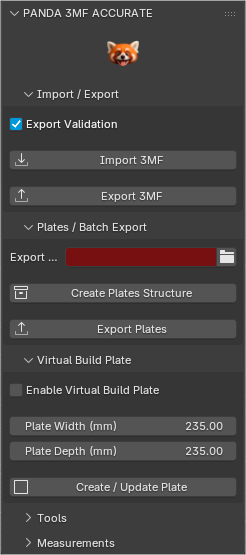

# Panda 3MF Accurate Toolbox

**Panda 3MF Accurate Toolbox** is a professional Blender addon focused on accurate, predictable, and production-ready **3MF import/export workflows for real-world 3D printing**.

The addon is designed to behave like native Blender tools, avoiding confusing custom dialogs or destructive automation, while preserving real-world scale, clean geometry, and slicer-friendly results.

It is built for makers, designers, and professionals who want reliable 3MF exports without breaking their Blender workflow.

---

## STL vs 3MF (Focused on 3D Printing)

| Feature | STL | 3MF |
|------|-----|-----|
| Scale accuracy | ❌ No units stored | ✅ Real units (mm) |
| Import size | ❌ Often incorrect | ✅ Correct scale |
| Orientation | ❌ Not preserved | ✅ Preserved |
| Print metadata | ❌ Geometry only | ✅ Supported |
| Colors / materials | ❌ Not supported | ✅ Supported |
| Slicer errors | ⚠️ More common | ✅ Less frequent |
| Manual fixes | ⚠️ Often needed | ✅ Minimal |
| Recommended format | ❌ Legacy | ✅ Modern standard |

---

## 🔧 Key Features

### 3MF Import / Export
- Import and export 3MF files directly in Blender.
- Uses Blender’s standard **Save As** workflow.
- Files are never overwritten automatically.
- Incremental filenames are used when needed.

### Pre-Export Validation
- Optional validation before export.
- Detects:
  - Active modifiers
  - Unapplied rotation or scale
  - Negative scale (mirrored objects)
- If an issue is detected, a popup lets the user decide how to proceed.

### Multi-Material Support
- Materials are exported **by Blender material name**.
- No forced material splitting.
- No color conversion.
- No slicer-specific assumptions.
- If an object has no materials, it exports as a single-material mesh.

This keeps the workflow simple, predictable, and slicer-agnostic.

### Batch Export (Plates)
- Create a plates structure.
- Assign objects to plates.
- Export all plates automatically.
- Each plate is exported as its own 3MF file.
- At the end of export, a summary is shown:
  - Number of plates
  - Number of exported objects

### Virtual Build Plate
- Visual reference only.
- Does not affect exports.
- Does not render.
- Can be enabled or disabled at any time.
- Automatically cleaned when disabled.

### Transform Tools for 3D Printing
- Align objects to Z = 0.
- Reset transforms.
- Apply transforms safely.
- Designed for print-ready geometry preparation.

### Real Size Measurements
- Displays accurate X / Y / Z dimensions in millimeters.
- Values match slicer-reported dimensions.

---

## 🧩 Typical Workflow

1. Model or import geometry into Blender.
2. Check real-world size using the Measurements panel.
3. Align objects and adjust transforms if needed.
4. (Optional) Organize parts using Virtual Build Plates.
5. Export using **Export 3MF** or **Export Plates**.
6. Open the exported file in your slicer  
   (Orca, Bambu Studio, PrusaSlicer, Cura).

---

## 🔍 Pre-Export Validation Details

### What is validated
- **Active modifiers**  
  Prevents exporting geometry that may be incomplete in slicers.
- **Unapplied transforms**  
  Allows the user to decide how transforms should be handled.

### Export options
- **Apply Object Transforms & Export**  
  Applies safe transforms to a temporary export copy.
- **Export Anyway**  
  Ignores artistic transforms and exports as-is.

### Important behavior
- The addon **never modifies the original Blender scene**
- All corrections apply only to the exported data
- Safe for repeated exports and iterations

---

## ⚠️ Limitations

- The addon does not repair or validate mesh topology.
- No automatic non-manifold fixing.
- Final print validation is always handled by the slicer.
- Geometry is exported exactly according to the chosen options.

---

## 🆓 Free vs Accurate Version

| Feature | Free Version | Accurate Version |
|------|--------------|------------------|
| Basic 3MF Import / Export | ✔ | ✔ |
| Standard Save As workflow | ✔ | ✔ |
| Pre-Export Validation | ✔ | ✔ |
| Multi-Material Support | ✖ | ✔ |
| Batch Export (Plates) | ✖ | ✔ |
| Virtual Build Plate | ✖ | ✔ |
| Advanced Tools | Limited | ✔ |
| Real Size Measurements | ✔ | ✔ |

---
<table align="center">
  <tr>
    <td align="center">
      
       <b>Free Version</b>
    </td>
    <td align="center">
      
       <b>Accurate Version</b>
    </td>
  </tr>
</table>

---

## Recommended Blender Units for 3D Printing

This addon is designed for Blender’s default metric configuration:

- **Unit System:** Metric
- **Unit Scale:** 1.0
- **Length:** Millimeters

Using a Unit Scale of `0.001` or relying on slicer-side scaling is not recommended and may cause incorrect results.

---

## UI Location

**View3D → Sidebar → 3MF Accurate**

Panels:
- Import / Export
- Plates / Batch Export
- Tools
- Virtual Build Plate
- Measurements

---

## Blender Version

- Blender 5.0 or newer

---

## 📦 Availability

### Free Version
Free version available on **GitHub**.  
Coming soon to **Blender Extensions** (pending approval).

---

## 🐞 Bug Reports & Support

This repository is used for:
- Documentation
- Issue tracking
- User support

⚠️ **The source code of Panda 3MF Accurate Toolbox is not publicly available.**

When reporting an issue, please include:
- Blender version
- Operating system
- Steps to reproduce

---

## 📄 Documentation

A complete **PDF User Manual (EN / ES)** is included with the Accurate version.

---

## © Credits

Developed and maintained by **Panda Print**.
